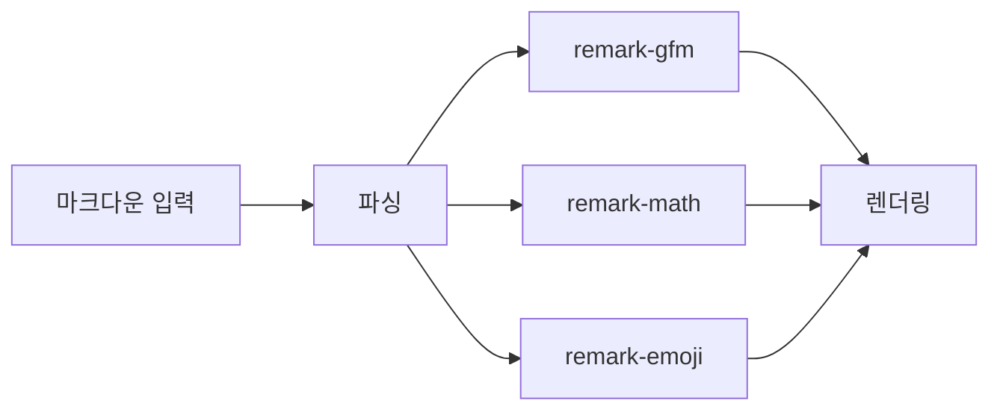

# 마크다운 에디터

무료 온라인 마크다운 에디터에 오신 것을 환영합니다.

## 기본 기능

### 문서함 & 저장

- 폴더 구조: 문서를 깔끔하게 정리
- 자동저장: 30초마다 자동 저장
- Undo/Redo: Ctrl+Z / Ctrl+Y

### 이미지 & 공유

- 드래그 앤 드롭 이미지 업로드
- 클립보드 붙여넣기 (Ctrl+V)
- 공유 링크 & QR 코드 생성

## 확장 마크다운 문법

### 수학 수식 (LaTeX)

인라인 수식: $E = mc^2$ 와 $\sum_{i=1}^{n} x_i$

블록 수식:

$$\int_{-\infty}^{\infty} e^{-x^2} dx = \sqrt{\pi}$$

#### 헤딩 4단계

##### 헤딩 5단계

###### 헤딩 6단계

### 하이라이트

==이 문장에서 중요한 부분을 강조할 수 있습니다.==

### 각주

마크다운 에디터는 다양한 문법을 지원합니다[^1].

### 이모지

이모지 단축코드: 🚀 ❤️ ⭐ 🔥

### Mermaid 다이어그램



### 체크리스트

- [x] 기본 마크다운 지원
- [x] 수학 수식 (LaTeX)
- [x] Mermaid 다이어그램
- [x] 이모지 단축코드
- [x] 하이라이트, 각주

### 접기/펼치기

<details>
<summary>클릭하여 상세 내용 보기</summary>

이 영역은 접고 펼칠 수 있습니다.

```python
def fibonacci(n):
    if n <= 1:
        return n
    return fibonacci(n-1) + fibonacci(n-2)
```

</details>

### 코드 구문 강조

```typescript
interface MarkdownPlugin {
  name: string;
  transform: (content: string) => string;
}
```

### 단축키

| 기능 | 단축키 | 설명 |
| --- | --- | --- |
| 저장 | Ctrl+S | 문서함에 저장 |
| 굵게 | Ctrl+B | 굵은 텍스트 |
| 기울임 | Ctrl+I | 기울임 텍스트 |
| 링크 | Ctrl+K | 링크 삽입 |
| PDF 출력 | Ctrl+P | PDF로 저장 |

> 이 에디터는 오픈소스입니다. 즐거운 마크다운 작성하세요!

## Footnotes

[^1]: GitHub Flavored Markdown 기반으로 확장된 문법을 지원합니다. ↩
